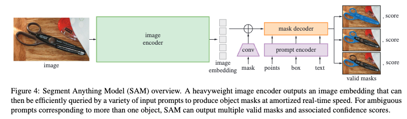
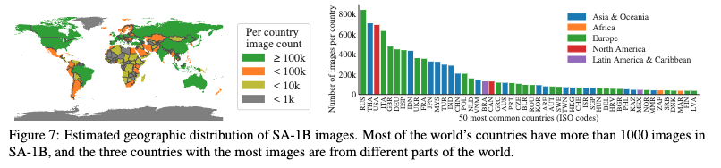
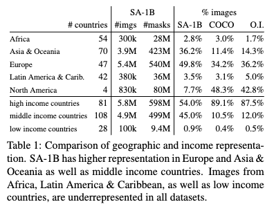
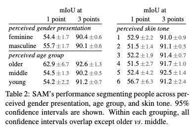

# Segment Anyting

> arXiv 2023. [[Paper](https://arxiv.org/abs/2304.02643)] [[Page](https://segment-anything.com/)] [[Github](https://github.com/facebookresearch/segment-anything)] 
> Alexander Kirillov, Eric Mintun, Nikhila Ravi, Hanzi Mao, Chloe Rolland, Laura Gustafson, Tete Xiao, Spencer Whitehead, Alexander C. Berg, Wan-Yen Lo, Piotr Dollár, Ross Girshick 
> Meta AI Research, FAIR 
> 5 Apr 2023 

### [Getting Started](./examples/README.md)

### Abstract

우리는 새로운 작업, 모델, 및 이미지 분할을 위한 데이터셋을 소개하는 Segment Anything (SA) 프로젝트를 소개합니다. 데이터 수집 루프에서 효율적인 모델을 사용하여 11M 개의 라이센스가 부여된 프라이버시를 준수하는 이미지에 대해 10억 개 이상의 마스크를 포함하는 지금까지 가장 큰 분할 데이터셋을 구축했습니다. 이 모델은 프롬프트 가능하도록 설계되고 훈련되어 새로운 이미지 분포와 작업에 제로샷으로 전이할 수 있습니다. 다양한 작업에서 모델의 능력을 평가한 결과, 제로샷 성능이 매우 인상적이며 종종 이전의 완전 감독된 결과와 경쟁하거나 이를 능가하는 것으로 나타났습니다. 우리는 컴퓨터 비전의 기초 모델 연구를 촉진하기 위해 1B 마스크와 11M 이미지가 포함된 Segment Anything Model (SAM) 및 해당 데이터셋 (SA-1B)을 [https://segment-anything.com](https://segment-anything.com/) 에서 공개하고 있습니다.

## 1. Introduction

Web-scale의 넓은 데이터로부터 pre-train된 LLM들은 NLP분야의 zero-shot, few shot 일반화에서 큰 변화를 일으켰다.

이러한 “Foundation Model”은 작업과 데이터의 분포를 훈련 과정에서 일반화하는 것이 가능하다.

이러한 능력은 “Prompt Engineering”이라는 것을 통해 구현된다. Prompt engineering은 직접 만든 텍스트로 언어 모델이 직면한 작업에 대한 유효한 텍스트 응답을 생성하도록 유도하는 데 사용된다.

충분한 데이터셋으로 scale되고 train된다면, 모델의 zero-shot과 few-shot의 성능은 그 fine tuned된 모델과 잘 비교된다. 

Foundation model은, 적긴 하지만, computer vision 분야에서도 연구가 진행되어 왔다.

아마도 가장 눈에 띄는 연구는 웹에서 쌍을 이룬 텍스트와 이미지를 정렬하는 것일 것이다. CLIP과 ALIGN은 contrastive learning을 사용해서, text와 image encoder를 학습시켜 두 modality를 정렬시키고자 했다.

한번 학습이 되고 나면, text prompt는 새로운 visual 컨셉과 데이터 분포에 대해 zero-shot 일반화가 가능했다.

또한, 이 encoder는 DALL.E처럼 다른 모듈의 downstream task를 가능하게 했다.

본 연구의 목표는 image segmentation 분야에서 foundation model을 만드는 것이다.

즉, 강력한 일반화를 가능하게 하는 task를 사용하여 광범위한 데이터셋에서 promptable model을 개발하고 사전 학습하는 것을 목표로 한다.

또한, 이 모델을 통해 prompt engineering을 사용하여 새로운 데이터 분포에 대한 다양한 하위 segmentation 문제를 해결하는 것을 목표로 한다.

우리는 다음 3가지의 질문을 다루며 모델을 개발하고자 한다.

1. What **task** will enable zero-shot generalization?
2. What is the corresponding **model** architecture?
3. What **data** can power this task and model?

Promptable segmentation task는 강력한 사전 학습 목적 함수를 제공하고 광범위한 downstream app들을 가능하게 할 수 있을 정도로 generilzed된 task를 의미한다.

## 2. Segment Anything Task

### **Task**

NLP 및 최근의 컴퓨터 비전에서, “파운데이션 모델”은 "prompting" 기술을 사용하여 **새로운** 데이터 세트 및 작업에 대해 제로샷 및 퓨샷 학습을 수행할 수 있는 모델을 의미한다. 

이러한 관점에서, 본 연구는 유효한 segmentation mask를 출력으로 하고, segmentation 대상을 나타내는 어떤 정보든 prompt가 되는, promptable segmentation task를 제안한다. 

Prompt는 어떤 객체를 segment해야 하는 지를 특정한다.

유효한 segmentation mask란 prompt가 모호하고 여러 객체를 포함하더라도, 하나 이상의 합리적인 mask를 출력해야 한다는 것이다.

본 논문에서는 promptable segmentation task를 **pre-training의 목표**로 사용하고, prompt engineering을 통한 **일반적인 downstream segmentation task를 해결하기 위해** 사용한다.

### **Pre-training**

Promptable segmentation task는 각 학습 샘플에 대한 일련의 프롬프트(ex. 점, 박스, 마스크)를 시뮬레이션하고 모델의 마스크 예측을 ground-truth와 비교하는 자연스러운 pre-training 알고리즘을 제안한다.

충분한 사용자 입력 후에 결국 유효한 마스크를 예측하는 것이 목표인 interactive segmentation과 달리 이 방법을 적용한다. **프롬프트가 모호한 경우에도 모든 프롬프트에 대해 항상 유효한 마스크를 예측하는 것이 목표**이다. 

이를 통해 데이터 엔진에서 요구하는 자동 주석을 포함하여 모호성이 포함된 use case에서 사전 학습된 모델이 효과적임을 보장한다. 

저자들은 이 task를 잘 수행하는 것이 어렵고 전문적인 모델링 및 학습 loss 선택이 필요하다는 점에 주목하였다.

### **Zero-shot transfer**

직관적으로 pre-trained task는 모델이 inference 시간에 모든 프롬프트에 적절하게 응답할 수 있는 능력을 부여하므로 하위 task는 적절한 프롬프트를 엔지니어링하여 해결할 수 있다.

예를 들어 고양이에 대한 boundary box detector가 있는 경우 detector의 box 출력을 모델에 프롬프트로 제공하여 고양이 instance segmentation를 해결할 수 있다.

일반적으로 다양한 실용적인 segmentation task는 프롬프트로 변환될 수 있다.

### **Related tasks**

Segmentation은 범위가 넓다.

- Interactive segmentation
- edge detection
- super pixelization
- object proposal generation
- foreground segmentation
- semantic segmentation
- instance segmentation
- panoptic segmentation

우리의 promptable segmentation task는 prompt engineering을 통해 기존에 있는 많은 task와 새로운 task들을 가능하게 하는 것을 목표로 한다.

이러한 능력은 task generalization의 한 유형이 될 수 있다.

이 task는 multi-task segmentation system과는 차이가 있다.

우리 작업의 중요한 차이점은 promptable segmentation을 위해 훈련된 모델이 **추론 시간에 새로운 다른 작업을 수행할 수 있다**는 것이다.

multi-task system에서 단일 모델은 joint semantic, instance, and panoptic segmentation와 같은 고정된 작업 집합을 수행하지만 훈련 및 테스트 작업은 동일하다.

예를 들어, instance segmentation을 수행하기 위해 promptable segmentation model를 기존 object detector과 결합하는 것과 같은 더 큰 시스템에서 구성 요소 역할을 수행할 수 있다.

### **Discussion**

Prompting과 composition은 단일 모델을 확장 가능한 방식으로 사용하여 잠재적으로 모델 설계 시 알려지지 않은 task를 수행할 수 있도록 하는 강력한 도구이다.

이 접근 방식은 다른 foundation model이 사용되는 방식과 유사하다. 저자들은 프롬프트 엔지니어링과 같은 기술로 구동되는 composition 가능한 시스템 설계가 고정된 일련의 task를 위해 특별히 학습된 시스템보다 더 다양한 애플리케이션을 가능하게 할 것으로 예상하였다.

Composition의 관점에서 promptable segmentation과 interactive segmentation을 비교하는 것도 흥미롭다. interactive segmentation model은 인간 사용자를 염두에 두고 설계되었지만 promptable segmentation을 위해 학습된 모델은 더 큰 알고리즘 시스템으로 구성될 수 있다.

## 3. Segment Anything Model

Segment Anything Model (SAM)에는 위 그림에 나와 있는 것처럼 세 가지 구성 요소가 있다.

1. image encoder
2. 유연한 prompt encoder
3. 빠른 mask decoder

저자들은 실시간 성능에 대한 특정 trade-off가 있는 Transformer 비전 모델을 구축하였다.

### **Image encoder**

확장성과 강력한 사전 학습 방법에 동기를 부여받아 고해상도 입력을 처리하도록 최소한으로 조정된 MAE pre-trained ViT를 사용한다. 이미지 인코더는 이미지당 한 번 실행되며 모델을 프롬프트하기 전에 적용할 수 있다.

### **Prompt encoder**

두 가지 집합의 프롬프트를 고려한다.

- Sparse(점, 박스, 텍스트)
- Dense(마스크)

CLIP의 텍스트 인코더를 사용하여 각 프롬프트 타입과 자유 형식 텍스트에 대해 학습된 임베딩으로 합산된 위치 인코딩으로 점과 박스를 나타낸다. 마스크는 convolution을 사용하여 임베딩되고 이미지 임베딩과 함께 element-wise하게 합산된다.

### **Mask decoder**

마스크 디코더는 이미지 임베딩, 프롬프트 임베딩, 출력 토큰을 마스크에 효율적으로 **매핑**한다.

Transformer 디코더 블록을 수정하고 **dynamic mask prediction head**를 사용한다.

수정된 디코더 블록은 모든 임베딩을 업데이트하기 위해 Prompt Self-Attention과 Cross-Attention을 두 방향(Prompt-to-Image Embedding과 그 반대)으로 사용한다.

두 블록을 실행한 후 이미지 임베딩을 업샘플링하고 MLP는 출력 토큰을 dynamic linear classifier로 매핑한 다음 각 이미지 위치에서 마스크 전경 확률을 계산한다.

### **Resolving ambiguity**

모델은 모호한 프롬프트가 주어지면 여러 개의 유효한 마스크를 하나의 출력으로 평균화한다.

이를 해결하기 위해 단일 프롬프트에 대해 여러 출력 마스크를 예측하도록 모델을 수정한다.

저자들은 3개의 마스크 출력이 대부분의 일반적인 경우를 처리하기에 충분하다는 것을 발견했다.

학습 중에는 마스크 중 최소 loss만 back propagation한다. 마스크 순위를 매기기 위해 모델은 각 마스크에 대한 신뢰도 점수(ex. 추정된 IoU)를 예측한다.

### **Efficiency**

전반적인 모델 디자인은 주로 효율성에 의해 설계되었다.

미리 계산된 이미지 임베딩이 주어지면 프롬프트 인코더와 마스크 디코더가 50ms 내에 CPU의 웹 브라우저에서 실행된다.

이 런타임 성능은 모델의 원활한 실시간으로 상호 작용하는 프롬프트를 가능하게 한다.

### **Losses and training**

DETR에서 사용된 focal loss와 dice loss의 선형 결합(가중합)으로 마스크 예측을 supervise한다.

기하학적 프롬프트의 혼합을 사용하여 promptable segmentation task를 위해 학습된다.

SAM이 데이터 엔진에 원활하게 통합될 수 있도록 마스크당 11라운드에서 임의로 프롬프트를 샘플링하여 interactive 설정을 시뮬레이션한다.

## 4. Segment Anything Data Engine

Segmentation mask가 인터넷에 풍부하지 않기 때문에 저자들은 11억 개의 마스크 데이터셋인 SA-1B를 수집할 수 있는 데이터 엔진을 구축했다. 데이터 엔진은 세 단계로 구성된다.

1. assisted-manual stage
2. semi-automatic stage
3. fully automatic stage

모델은 주석 입력 없이 마스크를 생성한다.

### **Assisted-manual stage**

첫 번째 단계에서는 고전적인 interactive segmentation과 유사하며 전문 주석 팀이 SAM에서 제공하는 브라우저 기반 interactive segmentation 도구를 사용하여 전경/배경 개체 지점을 클릭하여 마스크에 레이블을 지정했다. 

픽셀 정밀 “브러시”와 “지우개” 도구를 사용하여 마스크를 다듬을 수 있다. Model-assisted 주석은 사전 계산된 이미지 임베딩을 사용하여 브라우저 내에서 직접 실시간으로 실행되어 진정한 상호 작용하는 경험을 가능하게 한다. 

저자들은 개체에 레이블을 지정하는 데 의미론적 제약을 부과하지 않았으며 주석자는 “stuff”와 “things” 모두에 자유롭게 레이블을 지정했다. 

주석 작성자는 눈에 띄는 순서대로 개체에 레이블을 지정하라는 요청을 받았다고 하며 마스크가 주석을 추가하는 데 30초 이상이 걸리면 다음 이미지로 진행하도록 권장되었다.

이 단계의 시작에서 SAM은 공개된 segmentation 데이터셋을 사용하여 학습을 받았다. 

충분한 데이터 주석 후 SAM은 새로 주석이 달린 마스크만 사용하여 재학습되었다. 더 많은 마스크가 수집됨에 따라 이미지 인코더가 ViT-B에서 ViT-H로 확장되었으며 기타 아키텍처 세부 사항이 발전했다. 

총 6번 모델을 재학습했다. 모델이 개선됨에 따라 마스크당 평균 주석 시간이 34초에서 14초로 감소했으며, 이미지당 평균 마스크 수가 20개에서 44개 마스크로 증가했다.

전반적으로 이 단계에서 12만 개의 이미지에서 430만 개의 마스크를 수집했다.

### **Semi-automatic stage**

이 단계에서 저자들은 모델이 무엇이든 분할하는 능력을 향상시키기 위해 마스크의 다양성을 높이는 것을 목표로 했다.

눈에 잘 띄지 않는 물체에 주석 작성자의 초점을 맞추기 위해 먼저 신뢰할 수 있는 마스크를 자동으로 감지한다. 

그런 다음 이러한 마스크로 미리 채워진 이미지를 주석 작성자에게 제공하고 추가로 주석이 지정되지 않은 개체에 주석을 달도록 요청했다.

신뢰할 수 있는 마스크를 감지하기 위해 일반적인 “객체” 범주를 사용하여 모든 첫 번째 단계 마스크에서 boundary box detector를 학습했다.

이 단계에서 18만 개의 이미지에서 590만 개의 마스크를 추가로 수집했으며 (총 1020만 개의 마스크), 새로 수집된 데이터에 대해 주기적으로 모델을 재학습했다 (5회).

 마스크당 평균 주석 시간이 최대 34초로 되돌아갔으며 (자동 마스크 제외), 이러한 개체는 레이블을 지정하기가 더 어려웠기 때문이다. 이미지당 평균 마스크 수는 자동 마스크를 포함하여 44개에서 72개로 증가했다.

### **Fully automatic stage**

마지막 단계에서 주석은 완전히 자동으로 이루어진다. 이는 모델의 두 가지 주요 개선 사항으로 인해 가능했다.

1. 첫째, 이 단계를 시작할 때 이전 단계의 다양한 마스크를 포함하여 모델을 크게 개선할 수 있는 충분한 마스크를 수집했다.
2. 이 단계에서 모호한 경우에도 유효한 마스크를 예측할 수 있는 모호성 인식 모델을 개발했다.

구체적으로, 32×32 regular grid의 점으로 모델을 유도했고 각 점에 대해 유효한 객체에 해당할 수 있는 마스크 세트를 예측했다.

 모호성 인식 모델을 사용하면 점이 부분 또는 하위 부분에 있으면 모델이 하위 부분, 부분 및 전체 개체를 반환한다. 

모델의 IoU 예측 모듈은 신뢰할 수 있는 마스크를 선택하는 데 사용된다. 또한 안정적인 마스크만 식별하고 선택한다. 

마지막으로 자신 있고 안정적인 마스크를 선택한 후 Non-Maximal Suppression (NMS)를 적용하여 중복을 필터링한다. 

더 작은 마스크의 품질을 더욱 향상시키기 위해 여러 개의 겹치는 확대 이미지 crop도 처리하였다. 

데이터셋의 모든 1,100만 개 이미지에 완전 자동 마스크 생성을 적용하여 총 11억 개의 고품질 마스크를 생성했다.

## 5. Segment Anything Dataset

SA-1B dataset은 11M(11,000,000)개의 다양한, 고해상도의, licensed, privacy protecting 된 이미지들과 1.1B(1,100,000,000)개의 high-quality segmentation mask들로 구성된다. 이 데이터셋을 다른 데이터셋과의 mask quality와 property들을 비교한다. 

### **Images**

11M의 이미지들은 고해상도이기 때문에 data size가 크며, 접근성이나 저장공간의 문제가 발생한다.

그래서, 우리는 최소 길이를 가지는 side가 1500 pixel이 되도록 downsample 했다.

Downsampling된 데이터도 다른 데이터셋에 비하면 고해상도 이미지이다.

### **Masks**

Data engine으로부터 1.1B의 mask를 생성했고, 99.1%는 fully automatic 하게 만들어졌다.

따라서 fully automatic하게 만들어진 mask들의 퀄리티가 중요하다.

우리는 전문 주석(사람이 직접 작성한 주석)과 다른 유명한 데이터셋들이 얼마나 다양한 mask 요소들이 있는지 비교했다.

우리의 automatic한 mask가 퀄리티가 더 높았고 훈련에 효율적이었다.

따라서 SA-1B에는 automatically generated mask들만 포함하였다.

### **Mask quality**

500개의 샘플 이미지(50

### **Mask properties**

## 6. Segment Anything RAI Analysis **(Responsible AI)**

### **Geographic and income representation**

### **Fairness in segmenting people**

### **7.5 Zero-shot Text-to-Mask**

### **7.6 Ablations**

## 8. Discussion
