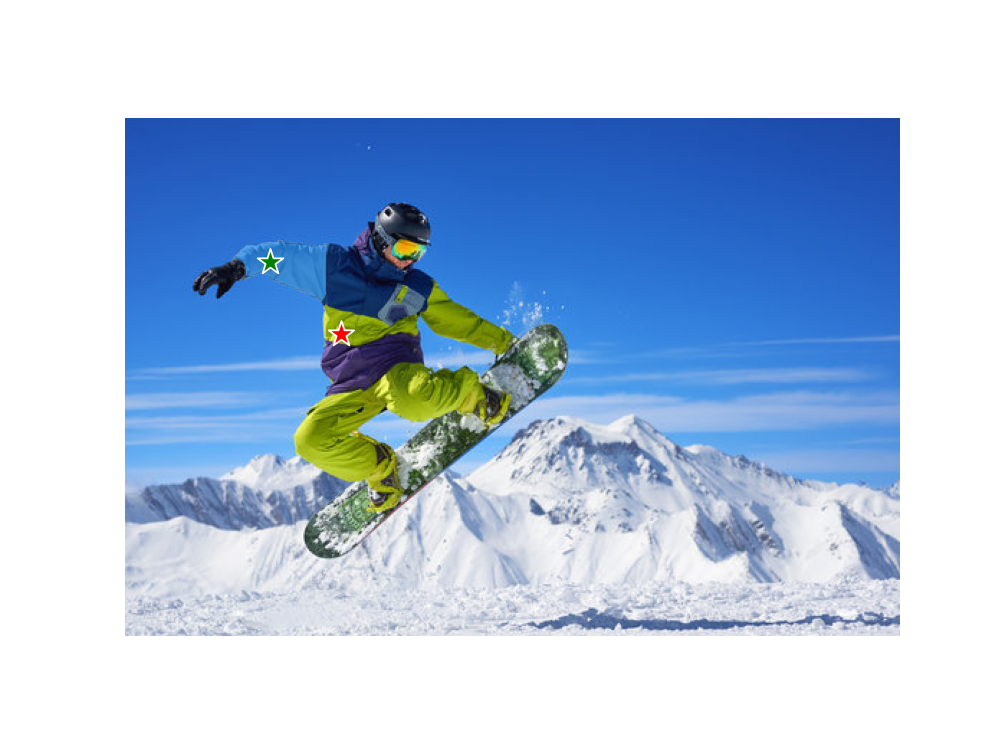
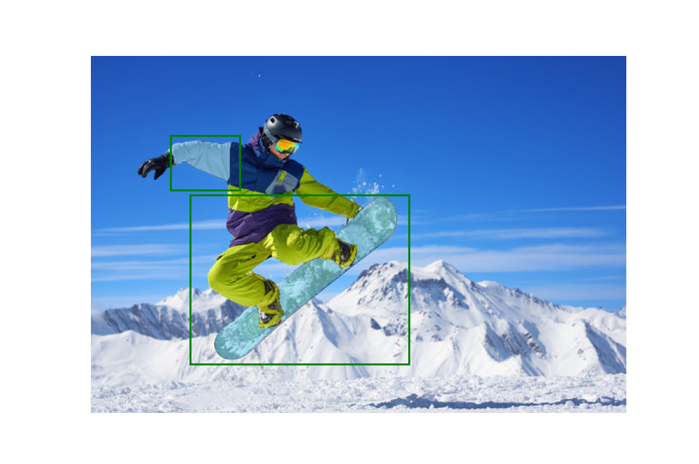
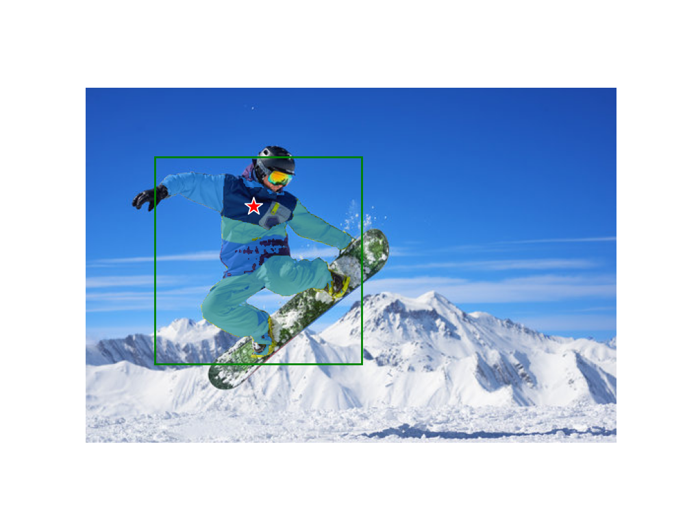
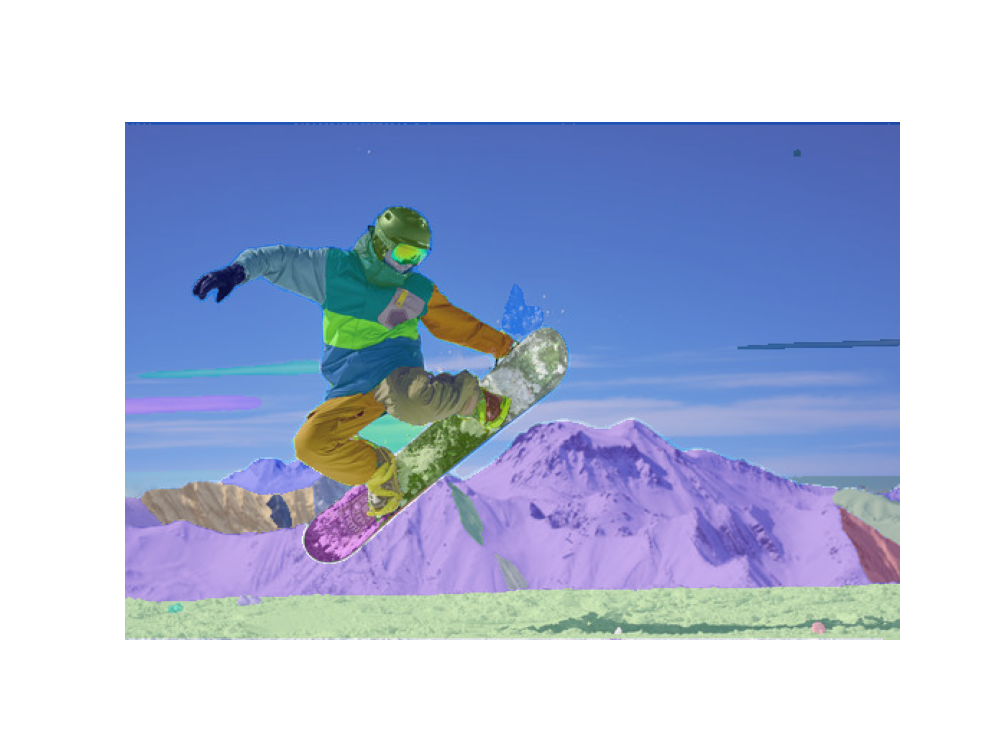

# Getting Started

## First download a model checkpoint.

- **`default` or `vit_h`: [ViT-H SAM model.](https://dl.fbaipublicfiles.com/segment_anything/sam_vit_h_4b8939.pth)**
- `vit_l`: [ViT-L SAM model.](https://dl.fbaipublicfiles.com/segment_anything/sam_vit_l_0b3195.pth)
- `vit_b`: [ViT-B SAM model.](https://dl.fbaipublicfiles.com/segment_anything/sam_vit_b_01ec64.pth)


## Define model and checkpoint.
    
These example use 

`<model_type> = ‘default’` , 

`<path/to/checkpoint> = ./sam_vit_h_4b8939.pth`
    
```python
from segment_anything import sam_model_registry
sam = sam_model_registry["<model_type>"](checkpoint="<path/to/checkpoint>")
```
    

## Using SAM

### with prompts

```python
from segment_anything import SamPredictor

IMAGE_PATH = './image.jpg'
image_bgr = cv2.imread(IMAGE_PATH)
image_rgb = cv2.cvtColor(image_bgr, cv2.COLOR_BGR2RGB)

predictor = SamPredictor(sam)
predictor.set_image(image_rgb)
masks, scores, logits = predictor.predict(<input_prompts>)
```

In `<input_prompts>` , you can use several prompts.

- one_point_prompt : Using single point, print ambiguous 3 object with score
- multiple_point_prompt : Using multiple point, print object that contain both points or contain only one.
- box_prompt : Using single or multiple box, print objects in the box
- point_and_box_prompt : Using combination of point and box, print object that {contain both points and boxes} or {exclude point in the box}

### automatically generating masks

```python
from segment_anything import SamAutomaticMaskGenerator

IMAGE_PATH = './image.jpg'
image_bgr = cv2.imread(IMAGE_PATH)
image_rgb = cv2.cvtColor(image_bgr, cv2.COLOR_BGR2RGB)

# if you want simple, just write model
mask_generator = SamAutomaticMaskGenerator(
    model=sam,
    points_per_side=32,
    pred_iou_thresh=0.86,
    stability_score_thresh=0.92,
    crop_n_layers=1,
    crop_n_points_downscale_factor=2,
    min_mask_region_area=100,  # Requires open-cv to run post-processing
)

masks = mask_generator.generate(image_rgb)
```

## Examples

### one_point_prompt

.png)

.png)

.png)

### multiple_point_prompt



### box_prompt



### point_and_box



### Auto generating_mask


